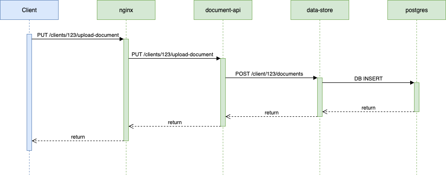

# Robin Interview - Document Storage System

This project demonstrates a multi-tenant document management system.

## Instructions

Add observability to this project in a way that requests and service health can be monitored.
Consider how you could aid engineers troubleshooting issues with the stack.

We are not looking for an exhaustive implementation for every facet of the project; we would
rather you show us a few targeted examples of observability features and patterns you would
implement in a real project of this structure.

The OTEL collector is included to receive data from the applications and represents a full
observability platform (such as DataDog) - we don't require any further UI tools here.

Show your workings via git commits. Don't spend more than 90 minutes on this.

Feel free to use AI assistants to help you complete this task, but avoid bashing the whole
task instructions into an LLM :). We want to understand what your thoughts and approaches are to
adding observability to an existing system.

Send your finished solution back to us, we will review it.
If we decide to proceed, we’ll use this solution as the context for follow up technical questions.

## Architecture

- **nginx**: Reverse proxy for the document-api service
- **document-api**: FastAPI service handling document uploads with client-based routing. Stores documents via the `data-store`
- **data-store**: FastAPI service managing document metadata in PostgreSQL with client isolation
- **postgres**: Database with client-based document isolation
- **otel-collector**: OpenTelemetry collector for distributed tracing (stdout output)



## API Endpoints

### Document API (via nginx on port 80)

- `PUT /clients/{client_id}/upload-document` - Upload document for specific client
- `GET /clients/{client_id}/documents/{document_id}` - Retrieve document metadata
- `GET /health` - Health check

### Data Store API (internal port 8001)

- `POST /clients/{client_id}/documents` - Store document metadata
- `GET /clients/{client_id}/documents/{document_id}` - Get document metadata
- `GET /health` - Health check

## OpenTelemtry Integration

The `document-api` project contains the client side setup required for a python application
to connect to the OpenTelemetry collector running via compose, see `document-api/telemetry.py`.

No observability points are currently sent using these configured exporters.

## Running the Project

```bash
# run all services
./setup-and-run.sh
```

## Testing

Use the included test script to verify the API after running `setup-and-run.sh`:

```bash
make test
```

## Development

Each service uses Python 3.13 with Poetry for dependency management.

### Package Management

The python applications use poetry to manage dependencies. If you do not wish to install poetry
on your machine, you can interact with it via the services defined in the compose file.

For example, installing a dependency into the `document-api` project:

```bash
docker-compose run --rm document-api poetry add opentelemetry-api
```

## Services

- **nginx**: `http://localhost:80` (main API access)
- **document-api**: `http://localhost:8000` (direct access)
- **data-store**: `http://localhost:8001` (internal service)
- **postgres**: `localhost:5432`
